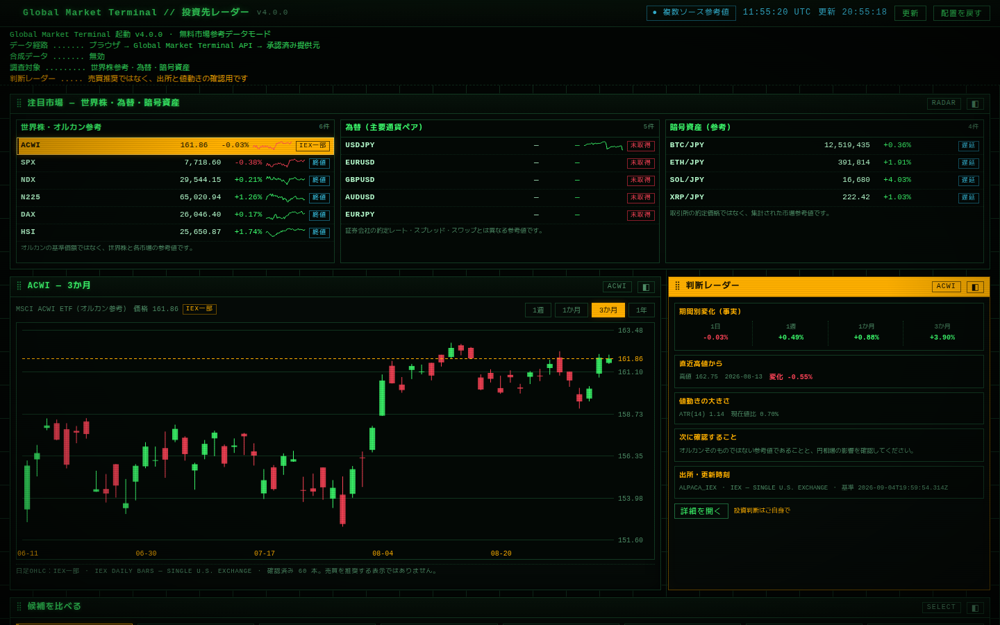

# Global Market Terminal

**English** | [日本語](README.ja.md)

A lightweight, self-hosted web dashboard for observing world markets on a single
screen — global equities and indices, foreign exchange, cryptocurrencies, and
precious metals — with an uncompromising focus on **data provenance**: every
value shows where it came from, its delivery classification, and its reference
time.

> **Formerly _GMT-1 Market Terminal_**. The old name may still appear in code
> comments or config as a codename; the public project name is now
> **Global Market Terminal**.

---

## Overview

Global Market Terminal is a **read-only market-observation dashboard**. It does
not place orders, create prices, scrape consumer-finance pages, or disguise a
source's coverage limits. It is designed to help you evaluate *which* market
data is actually worth paying for before you subscribe to a vendor.

The application is built around one principle: **never mistake a partial feed
for the whole market, or a reference price for an executable one.** Every quote
is tagged with its source, its delivery classification, and its reference
timestamp, so the user can make that distinction at a glance.

Key design choices:

- **Provenance-aware:** each instrument carries a status such as `REALTIME`,
  `DELAYED`, `EOD`, `PARTIAL_REALTIME`, `UNVERIFIED`, `STALE`, or
  `UNAVAILABLE`, plus the provider and the as-of time.
- **No synthetic data:** missing or failed values are shown as `STALE` or
  `UNAVAILABLE`; the app never invents a price, a layout, or a market cap.
- **Local-first:** binds to loopback by default and serves a restrictive
  Content-Security-Policy; the browser only talks to same-origin API routes.

---

## Screenshot



> A view of the running dashboard. It contains no API keys, personal data,
> internal IP addresses, or private hostnames — a clean dashboard with provider
> status badges visible.

---

## Features

Implemented and available in the current release:

- **Global equities & indices** — world indices (S&P 500, NASDAQ 100, Nikkei
  225, DAX, Hang Seng, Shanghai, ASX, EURO STOXX 50, FTSE 100 shown as
  unavailable when no free source resolves it, etc.) plus a U.S. equity heatmap
  (NVIDIA, Microsoft, Apple, energy, financials, …).
- **Foreign exchange** — major pairs (USD/JPY, EUR/USD, GBP/USD, AUD/USD,
  EUR/JPY) with ECB daily reference series.
- **Cryptocurrencies** — BTC, ETH, SOL, XRP priced in JPY via an aggregated
  public reference (no exchange account required).
- **Metals** — gold, silver, platinum, palladium spot reference (quota-cached).
- **Charts** — daily candles / daily-price lines per instrument, with an honest
  "close-only" label where only daily closes are available.
- **Market comparison** — a strip comparing a curated set of instruments.
- **Market timing** — world-session clocks (New York, London, Frankfurt,
  Hong Kong, Shanghai, Tokyo, Sydney) with open/closed/lunch state.
- **Drag-and-drop layout** — rearrange and resize panels; layout persists in
  the browser via `localStorage`.
- **Detail drawer** — verified quote, source, delivery classification,
  timestamps, tile-area basis, and provider-returned price history.
- **Provenance badges** — color-coded status badges for every instrument.

Features that are **not** implemented (do not assume they exist): order entry,
portfolio tracking, alerts/notifications, backtesting, and any paid-data
aggregation beyond what the configured free providers return.

---

## Architecture

```
Browser (HTML/CSS/JS)
        │  same-origin fetch, /api/v1/*
        ▼
Node.js application (server/server.mjs)
        │  reads provider credentials from environment
        ▼
Market data providers (pluggable adapters under server/providers/)
```

- The browser never calls vendor APIs directly and never holds provider
  credentials.
- The Node.js server loads provider keys from the process environment (`.env`
  for local dev, or an out-of-tree environment file for deployment) and proxies
  all vendor traffic.
- Provider responses are cached on disk (`data/`, git-ignored) with a short
  TTL, supporting honest `STALE` handling during upstream failures.

---

## Tech Stack

- **Node.js** (>= 22, native ES modules) — application server and provider
  adapters. No backend framework; uses the built-in `node:http` server.
- **HTML** — single static `index.html`.
- **CSS** — hand-written `css/terminal.css` (CRT-style dark theme, no
  frameworks, no external CDNs/fonts).
- **JavaScript** — vanilla browser JS (`js/*.js`), no bundler, no SPA
  framework.

No React/Vue/Svelte, no build step, no database.

---

## Data Providers

| Provider | Coverage | API key required? |
| --- | --- | --- |
| **Alpaca** (IEX feed) | U.S.-listed equities & ETFs (single-exchange IEX feed) | **Yes** (free paper-trading key) |
| **EODHD** | End-of-day reference for underlying indices | **Yes** (free tier token) |
| **Metals.dev** | Gold/silver/platinum/palladium spot reference | **Yes** (free API key) |
| **Twelve Data** | Optional licensed FX / general quotes | **Yes** (paid/licensed plan) |
| **CoinGecko** (public) | Aggregated crypto reference (BTC/ETH/SOL/XRP in JPY) | **No** (public endpoint) |
| **Frankfurter** (ECB) | ECB daily FX reference series | **No** (public endpoint) |

Notes:

- The free starting profile is **Alpaca (IEX) + EODHD + Metals.dev + the two
  keyless public sources (CoinGecko, Frankfurter)**. Twelve Data is kept for a
  formally licensed plan and is off by default.
- Alpaca's IEX feed is a **single U.S. exchange**, not a consolidated market
  feed. Items served from it are labelled `IEX PARTIAL` and the header reads
  `IEX DATA — PARTIAL MARKET`. It must never be read as a full-market last
  price.
- Metals.dev's free tier is quota-limited (≈100 requests/month); Global Market
  Terminal caps retrieval to three batches per day.
- Never embed any provider key in browser-side JavaScript. Keys live only in
  the server process environment.

---

## Installation

Prerequisites: **Node.js >= 22**.

```sh
git clone https://github.com/<your-org>/global-market-terminal.git
cd global-market-terminal
npm install
cp .env.example .env
```

Then edit `.env` and fill in the credentials for the providers you want to use
(see [Configuration](#configuration)). With `MARKET_DATA_PROVIDER=none` the app
starts safely and shows no prices rather than demo values.

> `npm install` is optional: the project has **no runtime dependencies**
> (Node.js built-ins only), so `node server/server.mjs` works without it. The
> install step is harmless and future-proofs the project.

---

## Configuration

Copy `.env.example` to `.env` and set the following variables. **Never commit
your `.env`.** Leave values blank for providers you do not use.

| Variable | Required / Optional | Provider | Purpose |
| --- | --- | --- | --- |
| `HOST` | Optional | — | Bind address for local Node runs (default `127.0.0.1`). Ignored on Cloudflare. |
| `PORT` | Optional | — | Listen port for local Node runs (default `8787`). Ignored on Cloudflare. |
| `MARKET_DATA_PROVIDER` | Required* | — | `none` \| `alpaca` \| `twelvedata`. Use `none` until a key is configured. |
| `ALPACA_API_KEY_ID` | Optional | Alpaca | Alpaca API key ID. |
| `ALPACA_API_SECRET_KEY` | Optional | Alpaca | Alpaca API secret key. |
| `TWELVE_DATA_API_KEY` | Optional | Twelve Data | API key (licensed plan only). |
| `EODHD_API_TOKEN` | Optional | EODHD | API token for EOD index reference. |
| `METALS_DEV_API_KEY` | Optional | Metals.dev | API key for spot metals. |
| `MARKET_DATA_REALTIME_IDS` | Optional | — | Comma-separated instrument IDs explicitly approved as real-time. |
| `MARKET_DATA_DELAYED_IDS` | Optional | — | Comma-separated instrument IDs classified as delayed. |
| `MARKET_DATA_EOD_IDS` | Optional | — | Comma-separated instrument IDs classified as end-of-day. |
| `QUOTE_CACHE_SECONDS` | Optional | — | Snapshot cache TTL (default `60`). |

\* `MARKET_DATA_PROVIDER` is required to be a known value; `none` is the safe
default that displays no prices.

### Headless / deployment secrets

The application reads variables from the **process environment** only. For a
headless deployment (e.g. a systemd user service), inject the same variables
from an environment file that lives **outside the repository**, for example:

```
EnvironmentFile=%h/.config/global-market-terminal/runtime.env
```

On **Cloudflare Workers**, set the same variable names as **Worker Secrets**
(`wrangler secret put <NAME>` or the Cloudflare dashboard). Secrets are injected
into `process.env` automatically at runtime — no `.env` file is read.

`runtime.env` and any `.env` must stay out of version control. The app performs
no filesystem reads of secrets beyond the process environment.

---

## Security

- **Never commit API keys.** Provider credentials are read from the environment
  at runtime.
- **`.env` is excluded from Git** (see `.gitignore`).
- **`runtime.env` and other production secrets must remain outside the
  repository.**
- **Do not embed secret API keys in browser-side JavaScript.** The browser
  only calls same-origin `/api/v1/*` routes.
- Use environment variables or your platform's secret storage for credentials.
- The server binds to `127.0.0.1` by default and sends a restrictive CSP.
- This is **not a trading system**. Do not expose it as a public,
  unauthenticated API.
- For internet deployment, place it behind HTTPS and authenticated private
  access; retain loopback binding for the application port and proxy only the
  authenticated frontend.

---

## Project Structure

```
.
├── public/                 # Static assets served by Cloudflare Static Assets
│   ├── index.html          # Static dashboard shell
│   ├── css/
│   │   └── terminal.css    # CRT-style theme (no frameworks/CDNs)
│   ├── js/
│   │   ├── adapters.js     # Browser data client (same-origin API)
│   │   ├── widgets.js      # Research widgets (universe, chart, radar, compare, clocks)
│   │   └── dashboard.js    # Boot, layout persistence, data state
│   └── assets/
│       └── fonts/          # Bundled M PLUS 1 Code (SIL OFL 1.1)
├── server/
│   ├── worker.mjs          # Cloudflare Worker entry (fetch handler + API routes)
│   ├── config.mjs          # Environment-driven configuration
│   ├── market-service.mjs  # Quote/bar orchestration + in-memory cache
│   ├── instruments.mjs     # Instrument registry
│   └── providers/          # Pluggable provider adapters
│       ├── alpaca.mjs
│       ├── eodhd.mjs
│       ├── metals-dev.mjs
│       ├── twelvedata.mjs
│       ├── coingecko.mjs
│       └── frankfurter.mjs
├── scripts/
│   └── verify-provider.mjs # Read-only provider preflight check
├── test/
│   └── market-service.test.mjs
├── wrangler.jsonc          # Cloudflare Workers configuration
├── .env.example            # Template (no secrets)
├── .gitignore
└── README.md
```

Notes:

- `data/` and `output/` are not used on Cloudflare; the Worker keeps an
  in-memory cache only. They may still be created by local Node runs and are
  git-ignored.
- `node_modules/` is not required for runtime (zero runtime dependencies) but is
  ignored regardless. `wrangler` is a devDependency used for local dev/deploy.

---

## Running

Local development with Wrangler (recommended):

```sh
npm install          # installs wrangler (devDependency)
npm start            # wrangler dev — serves the Worker + static assets locally
```

Then open the local URL Wrangler prints (defaults to <http://127.0.0.1:8787>).
Local secrets can be supplied via a `.env` file in the project root (git-ignored);
Wrangler injects them as `process.env`.

Legacy local Node run (without Wrangler):

```sh
node server/worker.mjs   # not used on Cloudflare; kept for reference only
```

Watch mode (auto-restart on change):

```sh
npm run dev
```

Verify a newly added provider key without hammering quotas repeatedly:

```sh
npm run verify:provider
```

---

## Testing

The project ships data-integrity tests (Node.js built-in test runner, no
framework):

```sh
npm test
```

Tests cover the instrument registry (no synthetic prices), provider adapter
scoping (e.g. Alpaca limited to U.S. equities), EODHD/EOD mapping, Metals.dev
quota limits, and an assertion that the browser code contains no vendor
endpoints or random price generators.

---

## Deployment

Global Market Terminal runs as a single **Cloudflare Worker** with **Static
Assets** for the frontend — no build step, no framework, no database.

### Prerequisites

- A Cloudflare account (Free plan is sufficient).
- `wrangler` installed locally (`npm install` adds it as a devDependency).
- Cloudflare authenticated (`wrangler login` or `wrangler login --device`).

### Set secrets

Set the same variable names used in `.env.example` as **Worker Secrets**. Secrets
are injected into `process.env` at runtime; never commit them.

```sh
wrangler secret put ALPACA_API_KEY_ID
wrangler secret put ALPACA_API_SECRET_KEY
wrangler secret put EODHD_API_TOKEN
wrangler secret put METALS_DEV_API_KEY
wrangler secret put MARKET_DATA_PROVIDER   # e.g. "alpaca"
```

`TWELVE_DATA_API_KEY` is optional (licensed plan only).

### Deploy manually

```sh
wrangler deploy
```

This uploads `public/` as Static Assets and the Worker entry
(`server/worker.mjs`) as the fetch handler. The Worker is available at
`https://<worker-name>.<subdomain>.workers.dev`.

### Automatic deploy from GitHub

Connect the GitHub repository to Cloudflare Workers Builds:

1. Cloudflare Dashboard → **Workers & Pages** → your Worker → **Settings** →
   **Builds** (or **Git integration**).
2. Install the GitHub App and authorize the `matzoka/global-market-terminal`
   repository.
3. Set the production branch to **`main`**.
4. Build command: _(none — no build step needed)_; Deploy command:
   `wrangler deploy`.

After connecting, every push to `main` triggers Cloudflare to build and deploy
automatically. No GitHub Actions workflow is required — Cloudflare's native Git
integration handles CI/CD.

### Notes

- The Worker keeps an **in-memory cache** for quotes and bars (TTL governed by
  `QUOTE_CACHE_SECONDS`); no disk, KV, or D1 storage is used.
- The app sends a restrictive CSP and binds only to the Worker's `fetch` handler
  on Cloudflare; there is no loopback port to expose.
- For a self-hosted Node deployment instead, see the headless-secret notes
  above and start `node server/worker.mjs` behind an authenticated reverse proxy.

---

## Troubleshooting

- **No prices shown / `configuration_required`**
  Set `MARKET_DATA_PROVIDER` to a configured provider and supply its
  credentials in `.env`. With `none`, the dashboard intentionally shows nothing.

- **A provider returns no data / `quote_refresh_failed`**
  Check the key is correct and not expired, and that the free plan covers the
  requested instrument. Some providers (e.g. EODHD) deliberately omit certain
  indices; those show `UNAVAILABLE` by design.

- **Port already in use**
  Another process holds the port. Start with `PORT=<other> npm start`.

- **Provider-side outage**
  Affected instruments fall back to the last cached value as `STALE`, or
  `UNAVAILABLE` if nothing was ever fetched. The rest of the dashboard keeps
  working.

- **Network failure**
  Same as above: cached values are shown as `STALE`; the app never synthesizes
  a price. Restore connectivity and refresh.

---

## Disclaimer

- **This project does not provide investment advice.**
- Market data may be **delayed, incomplete, or inaccurate**.
- **Users are responsible for their own investment decisions.**
- Nothing here is an executable price or an order. Verify any figure against
  your own authorized source before acting on it.

---

## Credits / Acknowledgements

- **Market data**: [Alpaca](https://alpaca.markets),
  [Twelve Data](https://twelvedata.com),
  [EODHD](https://eodhd.com),
  [Metals.dev](https://metals.dev),
  [CoinGecko](https://www.coingecko.com), and
  [Frankfurter](https://frankfurter.dev) (ECB reference rates).
- **Font**: [M PLUS 1 Code](https://github.com/coz-m/MPLUS_FONTS) by the
  M+ FONTS Project Authors, licensed under the **SIL Open Font License 1.1**
  (see `assets/fonts/OFL.txt`). The font is redistributed under the OFL; the
  application code is licensed separately (see [LICENSE](./LICENSE)).

---

## License

See [LICENSE](./LICENSE).
